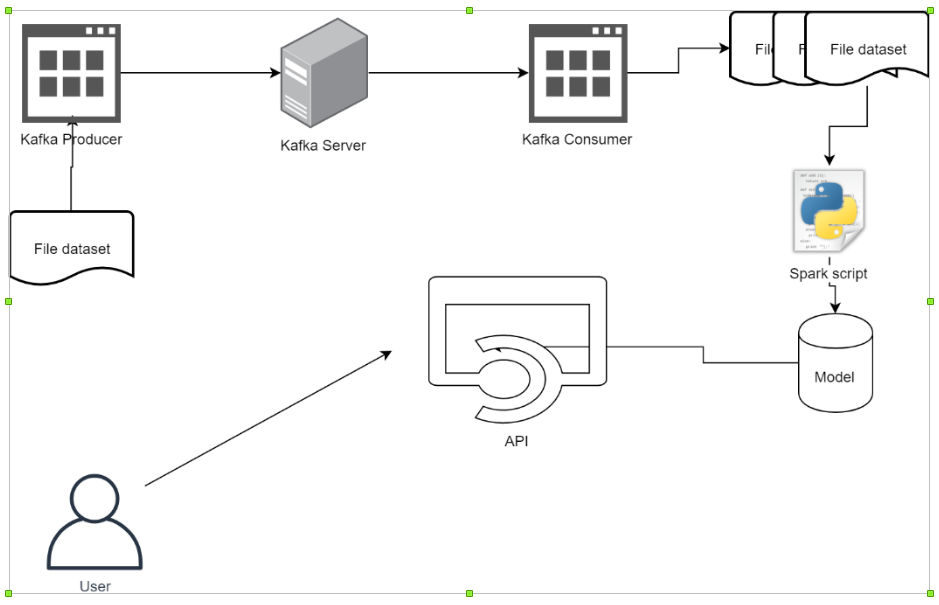
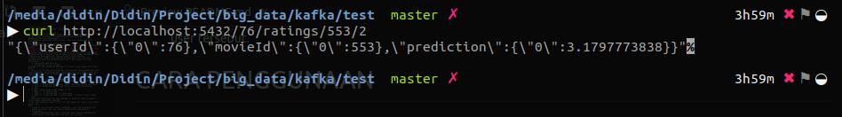

# FINAL PROJECT BIG DATA
## MUHAMMAD FARIS DIDIN ANDIYAR - 05111540000118

  
Terdapat sebuah sistem Big Data dengan arsitektur seperti gambar di atas. Sistem tersebut berfungsi untuk menyimulasikan pemrosesan data stream menggunakan Kafka dan Apache Spark.  
Untuk kemudahan pemrosesan, Kafka Consumer tidak wajib menggunakan Spark Streaming.  
Alur yang diharapkan adalah sebagai berikut.  
1. Terdapat sebuah file dataset yang akan dibaca secara sekuensial oleh Kafka Producer.  
**TIDAK DIPERBOLEHKAN MENGGUNAKAN DATASET YANG SUDAH DIGUNAKAN PADA TUGAS-TUGAS SEBELUMNYA.**  
2. Kafka Producer akan mengirimkan data per baris ke Kafka Server seolah-olah sedang melakukan streaming. Proses ini dapat dilakukan dengan menambahkan jeda/sleep secara random agar data tidak dikirimkan secara langsung.  
3. Kafka consumer membaca data yang ada di dalam Kafka server dan akan menyimpan data yang diterima dalam bentuk batch. Batch dapat ditentukan berdasarkan:  
    a. Jumlah data yang diterima  
    b. Rentang waktu proses (window)  
Sehingga nanti akan didapatkan beberapa file dataset sesuai dengan batch yang dipilih.  
4. Spark script bertugas untuk melakukan training model sesuai dengan data yang masuk. Diharapkan ada beberapa model yang dihasilkan sesuai dengan jumlah data yang masuk. Kalian dapat menentukan sendiri berapa jumlah data yang diproses untuk tiap model.  
Contoh:  
a. Terdapat 3 model dengan skema sebagai berikut:  
    1. Model 1: Menggunakan data selama 5 menit pertama atau 500.000 data pertama.  
    2. Model 2: Menggunakan data selama 5 menit kedua atau 500.000 data kedua.  
    3. Model 3: Menggunakan data selama 5 menit ketiga atau 500.000 data ketiga.  
b. Terdapat 3 model dengan skema sebagai berikut:  
    1. Model 1: 1/3 data pertama  
    2. Model 2: 1/3 data pertama + 1/3 data kedua  
    3. Model 3: 1/3 data pertama + 1/3 data kedua + 1/3 data terakhir (semua data)  
5. Model-model yang dihasilkan akan digunakan di dalam API. Buatlah endpoint sesuai dengan jumlah model yang ada.
6. User akan melakukan request ke API. API akan memberikan respon sesuai dengan request user.  
Misal:  
    • Apabila user melakukan request rekomendasi, maka input yang diperlukan adalah rating dari user dan response yang diberikan adalah daftar rekomendasi.  
    • Apabila modelnya adalah kasus clustering, maka response yang diberikan adalah ada di cluster mana data input dari user tersebut.

# CARA PENGGUNAAN  
1. Download Binary Apache Kafka [klik di sini](https://kafka.apache.org/downloads)
2. Extract binary pada directory yang diinginkan.  
   ```tar -xf {nama file binary} ```  
3. Jalankan Zookeeper Kafka.  
   ```bin/zookeeper-server-start.sh config/zookeeper.properties```
4. Jalankan Kafka Server.  
   ```bin/kafka-server-start.sh config/server.properties```
5. Buat topic pada Kafka.  
   ```bin/kafka-topics.sh --create --zookeeper localhost:2181 --replication-factor 1 --partitions 1 --topic test```
6. Jalankan script Produser.  
   ```python3 producer.py```
7. Jalankan script Consumer.  
   ```python3 producer.py```
8. Import Environment PySpark.  
   ```export PYSPARK_PYTHON=python3```
9.  Jalankan Server API.  
    ```python3 server.py```
10. masukkan request API.  
    dengan format : ```http://localhost/<int:userId>/ratings/<int:movieId>/<int:model>```  
    ```curl http://localhost:5432/76/ratings/553/2```  
